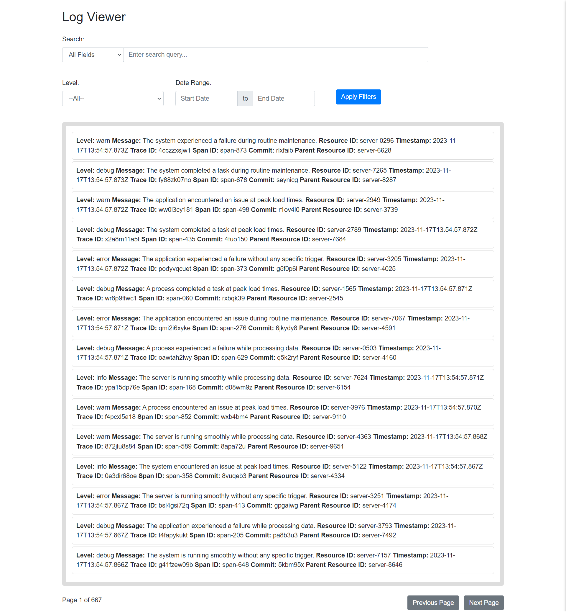

<!-- Improved compatibility of back to top link: See: https://github.com/othneildrew/Best-README-Template/pull/73 -->
<a name="readme-top"></a>


<!-- PROJECT LOGO -->
<br />
<div align="center">
  <a href="https://github.com/github_username/repo_name">
    
  </a>

<h3 align="center">Log Viewer Service</h3>

  <p align="center">
    Log Viewer is a Django-based application that provides a user-friendly log viewer for searching and filtering logs. It consists of a Log Ingestor for inserting logs from different services and a Query Interface for efficient log retrieval.

  </p>
</div>



<!-- TABLE OF CONTENTS -->
<details>
  <summary>Table of Contents</summary>
  <ol>
    <li>
      <a href="#about-the-project">About The Project</a>
      <ul>
        <li><a href="#built-with">Built With</a></li>
      </ul>
    </li>
    <li>
      <a href="#getting-started">Getting Started</a>
      <ul>
        <li><a href="#prerequisites">Prerequisites</a></li>
        <li><a href="#installation">Installation</a></li>
      </ul>
    </li>
    <li><a href="#usage">Usage</a></li>
    <li><a href="#roadmap">Roadmap</a></li>
    <li><a href="#contributing">Contributing</a></li>
    <li><a href="#license">License</a></li>
    <li><a href="#contact">Contact</a></li>
    <li><a href="#acknowledgments">Acknowledgments</a></li>
  </ol>
</details>


<!-- ABOUT THE PROJECT -->
## About The Project

[![Product Name Screen Shot][product-screenshot]](https://example.com)

This log viewer has simple user friend ui for searching and filtering logs. For efficient log ingression the system used kafka message que and stores logs in postgres database I uses batch insersion to reduce db load and reduce latency.

<p align="right">(<a href="#readme-top">back to top</a>)</p>

[](https://www.youtube.com/watch?v=lgRI_8w3UKo)


### Built With
* Python 3.x
* Django
* Kafka
* Bootstrap
* Postgres
* Docker


<p align="right">(<a href="#readme-top">back to top</a>)</p>


<!-- GETTING STARTED -->
## Getting Started

Clone the repo
```sh
git clone https://github.com/dyte-submissions/november-2023-hiring-acash-r.git
```
Django project directory starts with name log_viewer
The poject uses python v3.11 and Django v4.x

### Prerequisites

Create a python virtual environment
1. install packages using pip
* pip
  ```sh
  pip3 install -r requirements.txt
  ```

2. Setup database
This require you to install postgress database and set your db name, username, password and host in .env file preassing inside django project directory
   ```sh
   Example
   DB_NAME="my_log_viewer"
   DB_USERNAME="my_logadmin"
   DB_PASSWORD="my_logs@12345"
   DB_HOST="localhost"
   DB_PORT=5433
   ```
1. Now run the following command to make migrations and migrate the database
- The command should be run inside django project directory log_viewer containing manage.py file

  ```sh
  python3 manage.py makemigrations
  python3 manage.py migrate
  ```

4. Install docker and run docker compose
   ```sh
   docker compose -f docker_compose.yml up -d
   ```
   this command will start the docker containers

5. Ensure that app_logs folder to be present in log_viewer project directory to store app logs
  
6. Run the Django server in Django project directory
   ```sh
   python manage.py startserver
   ```
   This will start server on port 3000 by default 
   - The log viewer and log consumer will be running on port 3000
   - If you want to run server on another port run the following command
   ```sh
   python manage.py runserver 8001
   ```
7. Run log consumer in another terminal
   This command runs kafka consumer that picks logs from kafka broker and stores it in postgres database

   ```
   python manage.py runconsumer
   ```

8. You Dont need to run log ingressor seperatorly as the endpoint which consumes logs is in the same project that we started earlier with this command
   
   ```sh
   python manage.py startserver
   ```
<!-- USAGE EXAMPLES -->
## Usage

1. Start the Log Ingestor by running python manage.py startserver and start sending post request to http://localhost:3000/ingest-logs/
```sh
   curl  -X POST \
  'http://localhost:3000/ingest-logs/' \
  --header 'Accept: */*' \
  --header 'User-Agent: Thunder Client (https://www.thunderclient.com)' \
  --header 'Content-Type: application/json' \
  --data-raw '{
  "level": "warn",
  "message": "The server is running smoothly during routine maintenance.",
  "resourceId": "server-1491",
  "timestamp": "2023-11-05T13:54:57.797882Z",
  "traceId": "h830f0kd7q",
  "spanId": "span-532",
  "commit": "mc11wbf",
  "metadata": {
    "parentResourceId": "server-3518"
  }
}'
```

2. Access the Query Interface at http://localhost:3000 to search and filter logs using the provided interface.
   
3. If the data is comming at faster rates it will help if you increase the batch_size in queue_listener.py file.

## Feature Implemented
### Log Ingestor:

- Efficient log ingestion mechanism ensure scalability to high volume of logs.
- Batch insertion to reduce db load and potentially reduce latency.
- Scalable architecture for handling high volumes of logs.
- Runs on port 3000 by default
  
### Query Interface:

- User-friendly Web UI for log search and filtering.
- Filter logs based on various parameters such as level,    message, resourceId, timestamp, traceId, spanId, commit, metadata.parentResourceId.
- Quick and efficient search results.
- Searches logs between two date ranges.
- Provide real-time log ingestion and searching capabilities.
- Provide real-time log ingestion and searching capabilities.

<!-- ROADMAP -->
## Roadmap

- [ ] Implement ElasticSearch for faster search
    - [ ] ElasticSearch Supports Regular Expression Searching
- [ ] Make batch size,broker url and other configurations configurable from .env file


## Other
- For generating log data you can use the script generate_dummy_logs.py
    - this can be used to send post request to server and populating database with dummy data
    - To run use this commnd : ``python generate_dummy_logs.py ``
- dummy_logs.log is sample log file 
- you can use populate_logs_from_log_file if you have a log file

[](https://www.youtube.com/watch?v=LRjsj0x0rN0)

<p align="right">(<a href="#readme-top">back to top</a>)</p>


<!-- CONTRIBUTING -->
## Contributing

Contributions are what make the open source community such an amazing place to learn, inspire, and create. Any contributions you make are **greatly appreciated**.

If you have a suggestion that would make this better, please fork the repo and create a pull request. You can also simply open an issue with the tag "enhancement".
Don't forget to give the project a star! Thanks again!

1. Fork the Project
2. Create your Feature Branch (`git checkout -b feature/AmazingFeature`)
3. Commit your Changes (`git commit -m 'Add some AmazingFeature'`)
4. Push to the Branch (`git push origin feature/AmazingFeature`)
5. Open a Pull Request

<p align="right">(<a href="#readme-top">back to top</a>)</p>


<!-- LICENSE -->
## License

Distributed under the MIT License. See `LICENSE.txt` for more information.

<p align="right">(<a href="#readme-top">back to top</a>)</p>


<!-- CONTACT -->
## Contact

Akash Raj - [@twitter_handle](https://twitter.com/twitter_handle) - akashraj7713@gmail.com

Project Link: [https://github.com/akashraj98/](https://github.com/github_username/repo_name)

<p align="right">(<a href="#readme-top">back to top</a>)</p>


